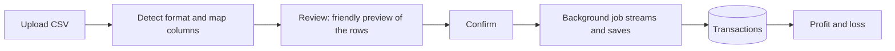
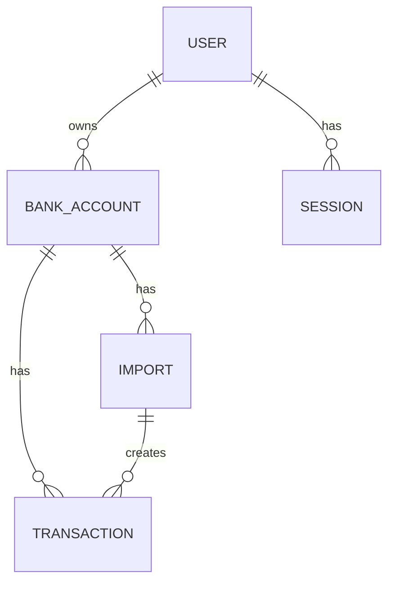
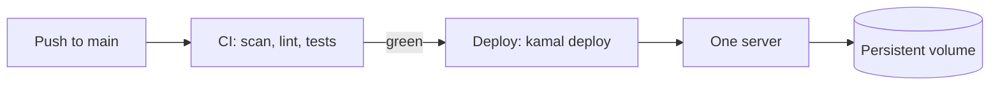

# Ledgerly

Turn a bank statement into a profit and loss in a few clicks. Ledgerly is for small
business owners who are not accountants. Upload a CSV from your bank, and see one clear
number: what you actually made.

- Live demo: https://ldgrly.app
- Demo login: `demo@ledgerly.app` / `DemoPassw0rd!`

## Table of contents

- [What it does](#what-it-does)
- [Tech stack](#tech-stack)
- [Architecture](#architecture)
- [How a statement becomes a profit and loss](#how-a-statement-becomes-a-profit-and-loss)
- [Data model](#data-model)
- [Key decisions](#key-decisions)
- [Run it locally](#run-it-locally)
- [Tests](#tests)
- [Deployment](#deployment)

## What it does

The goal is simple accounting for people who do not have a finance degree. Plain words,
few steps, one number up front, and detail tucked away until you ask for it. Simple must
never mean wrong, so the money math is exact and the numbers can be trusted.

The flow is short:

1. Add a bank account and pick its currency.
2. Import a CSV statement. Ledgerly reads the format for you and shows a preview.
3. See the profit and loss: money in, money out, and profit.
4. Switch off any row that should not count, like a transfer between your own accounts or
   a personal expense. The profit updates right away.

## Tech stack

| Area | Choice | Version |
| --- | --- | --- |
| Language | Ruby | 4.0.5 |
| Framework | Rails | 8.1.3 |
| Database | SQLite | 2.1+ |
| Front end | Hotwire (Turbo + Stimulus), import maps, Propshaft | ships with Rails 8 |
| Background jobs | Solid Queue | ships with Rails 8 |
| Cache and cable | Solid Cache, Solid Cable | ships with Rails 8 |
| Passwords | Argon2id (the `argon2` gem) | 2.3 |
| File uploads | Active Storage on local disk | ships with Rails 8 |
| Web server | Puma behind Thruster | ships with Rails 8 |
| Deploy | Kamal to one server, image on GitHub Container Registry | ships with Rails 8 |

No React, no Redis, no Sidekiq, no Devise. The whole thing runs as one container on one
server, with everything on SQLite.

## Architecture

Ledgerly uses a functional core with an imperative shell. The core is plain Ruby with no
database and no input or output. It takes data in and gives data out, so it is easy to
test. The shell is the part that touches the world: controllers, Active Record models, and
the background job.


Money is always stored as a whole number of cents, never as a float, so rounding can never
drift. The core lives in `app/lib`. The shell lives in the usual Rails folders.

## How a statement becomes a profit and loss

Banks all export CSV in their own shape. Some use one signed amount column, some use
separate debit and credit columns. Dates can be day first or month first. Separators can be
commas or semicolons. Ledgerly handles this with a small pipeline: it guesses the format,
lets you confirm it, then imports in the background.



Notes on the import:

- Large files are streamed and saved in batches, so a big statement does not block the app.
- Each row gets a fingerprint, with a unique index, so importing the same file twice adds
  nothing new.
- A single bad row is skipped and counted, it does not fail the whole import.
- Detection is honest about its limits. When a date could be day first or month first and
  there is no way to tell, it says so instead of guessing.

## Data model



Each bank account has one currency, so a profit and loss is always in a single currency
with no exchange rates. Deleting an account removes its imports, its transactions, and the
uploaded files with it, so a mistake is cheap to undo.

## Key decisions

- **SQLite, not Postgres.** It is production grade in Rails 8 and keeps the deploy to one
  server with no extra services. Solid Queue, Solid Cache, and Solid Cable all run on it,
  so there is no Redis. Move to Postgres only when more than one server is needed.
- **Hand written auth with Argon2id, not a gem like Devise.** The login work is small and
  visible. Login is constant time so it does not leak which emails exist, and sessions live
  in the database so they can be revoked.
- **One include switch, not a tax taxonomy.** Two real cases break a naive profit and loss:
  transfers between your own accounts, and personal spending in a business account. To a
  normal person these are the same thing, money that should not count. So there is one plain
  switch per row, "counts toward profit", on by default. No jargon.
- **Mapping is data, not code.** Bank formats are detected and confirmed, not hard coded.
  A new bank never needs a code change or a deploy, and a bad guess is caught on the review
  screen before any data is saved.
- **Money is exact.** Integer cents everywhere, with `BigDecimal` for parsing, never floats.

## Run it locally

You need Ruby 4.0.5 (see `.ruby-version`).

```bash
bin/setup            # install gems and prepare the database
bin/rails db:seed    # load the demo account and sample statements
bin/rails server     # then open http://localhost:3000
```

Sign in with `demo@ledgerly.app` / `DemoPassw0rd!`. The sample CSVs used by the demo also
live in `db/seeds/statements`, so you can upload one to try a live import.

## Tests

```bash
bin/rails test
```

The suite is mostly integration tests that walk the real flow: sign up, sign in, the auth
gate, import to rows, the profit and loss math, the include toggle, editing and deleting an
account, and the dashboard. Unit tests are kept for the parts that are hard to reach through
the flow.

## Deployment

Ledgerly deploys with Kamal to a single server, with the image stored on GitHub Container
Registry and TLS handled by the built in proxy.



Everything that must survive a redeploy lives on one persistent volume at `/rails/storage`:
the SQLite databases, the Solid Queue database, and the uploaded statement files. The
container is rebuilt on every deploy, the volume is kept. GitHub Actions runs the checks on
every push to `main`, and on green it deploys.
