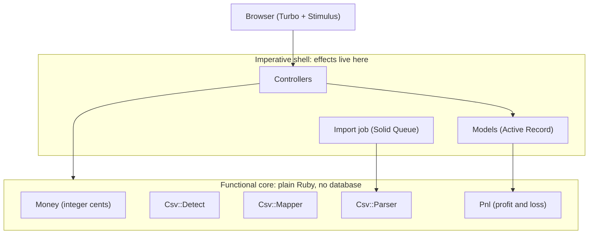
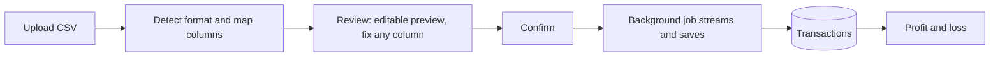
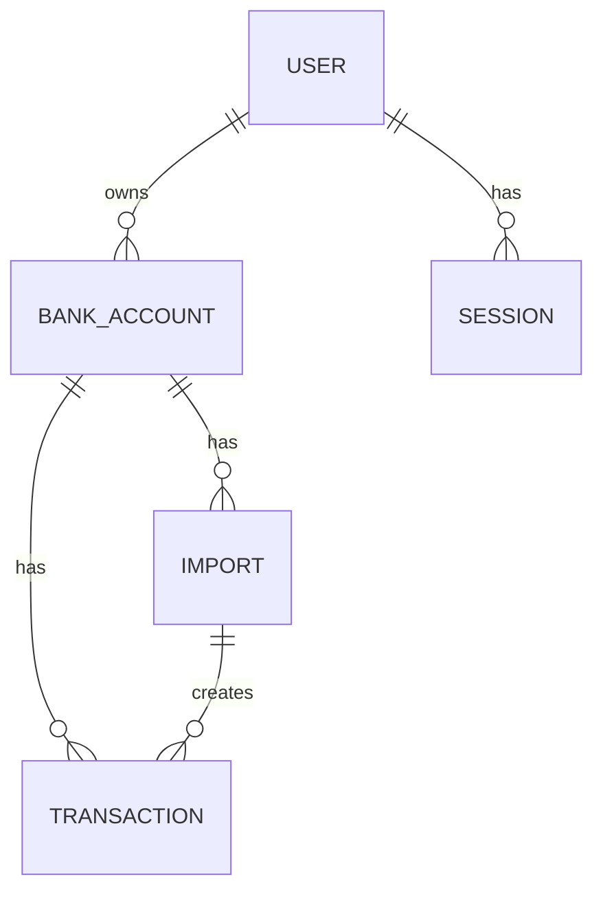
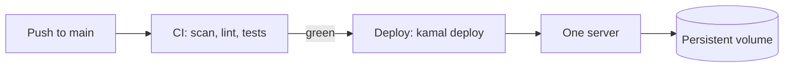

# Ledgerly

Turn a bank statement into a profit and loss in a few clicks. Ledgerly is for small
business owners who are not accountants. Upload a CSV from your bank, and see one clear
number: what you actually made.

- Live demo: https://ldgrly.app
- Demo login: `demo@ledgerly.app` / `DemoPassw0rd!`

## Table of contents

- [What it does](#what-it-does)
- [Tech stack](#tech-stack)
- [Architecture](#architecture)
- [How a statement becomes a profit and loss](#how-a-statement-becomes-a-profit-and-loss)
- [What the profit and loss measures](#what-the-profit-and-loss-measures)
- [Data model](#data-model)
- [Key decisions](#key-decisions)
- [Limitations and trade-offs](#limitations-and-trade-offs)
- [Run it locally](#run-it-locally)
- [Tests](#tests)
- [Deployment](#deployment)

## What it does

Simple accounting for people without a finance degree. Plain words, few steps, one number up
front, detail tucked away until you ask. Simple never means wrong, so the money math is exact.

The flow is short:

1. Add a bank account and pick its currency.
2. Import a CSV statement. Ledgerly reads the format for you and shows a preview you can adjust if anything looks off.
3. See the profit and loss: money in, money out, and profit.
4. Switch off any row that should not count, like a transfer between your own accounts or
   a personal expense. The profit updates right away.

## Tech stack

| Area | Choice | Version |
| --- | --- | --- |
| Language | Ruby | 4.0.5 |
| Framework | Rails | 8.1.3 |
| Database | SQLite | 2.1+ |
| Front end | Hotwire (Turbo + Stimulus), import maps, Propshaft | ships with Rails 8 |
| Background jobs | Solid Queue | ships with Rails 8 |
| Cache | Solid Cache (also rate limiting) | ships with Rails 8 |
| Passwords | Argon2id (the `argon2` gem) | 2.3 |
| File uploads | Active Storage on local disk | ships with Rails 8 |
| Web server | Puma behind Thruster | ships with Rails 8 |
| Deploy | Kamal to one server, image on GitHub Container Registry | ships with Rails 8 |

No React, no Redis, no Sidekiq, no Devise. The whole thing runs as one container on one
server, with everything on SQLite.

## Architecture

Ledgerly leans on a functional core with an imperative shell. The core (`app/lib`) holds the
logic with no database, no web, and no writes. `Money`, `Pnl`, `Csv::Mapper`, and `Csv::Mapping`
are pure, data in and data out. The two CSV readers, `Csv::Detect` and `Csv::Parser`, are the
one concession: they stream from an IO the shell opens for them, so they do input but touch
nothing else. The shell, controllers, Active Record models, and the import job, owns the rest:
files, the database, and rendering.



Money is always stored as a whole number of cents, never as a float, so rounding can never
drift. The core lives in `app/lib`. The shell lives in the usual Rails folders.

## How a statement becomes a profit and loss

Banks all export CSV in their own shape. Some use one signed amount column, some use
separate debit and credit columns. Dates can be day first or month first. Separators can be
commas or semicolons. Ledgerly handles this with a small pipeline: it guesses the format,
lets you adjust and confirm it, then imports in the background.



Notes on the import:

- The review is editable but quiet. Detection fills in every field (date format, separator,
  amount style, each column); the controls stay tucked away unless a read fails. The preview
  re-reads as you change a field, cell by cell, so a row shows the columns it could read and
  flags the one it could not.
- Ambiguous slash dates (every day 12 or under) fall back to month first, and the flagged
  preview lets you switch the format if the guess was wrong.
- A confirmed mapping is remembered on the bank account, so the same format imports in one
  click next time. If the bank changes its layout, Ledgerly detects afresh.
- Large files are streamed and saved in batches, so a big statement does not block the app.
- Each row gets a fingerprint, with a unique index, so importing the same file twice adds
  nothing new.
- A single bad row is skipped and counted, it does not fail the whole import.

## What the profit and loss measures

Ledgerly's profit and loss is a real statement, but a deliberately simple one. It is **cash
basis**: built from the money that actually moved through the bank account in the period, not
from invoices or accruals, so it matches what an owner sees in their bank. And it is **sign
based**: money in is the sum of positive amounts, money out is the sum of negative amounts,
and profit is the net. All of it in integer cents, so the math is exact.

It is not a full accountant-style statement (revenue, cost of goods sold, gross profit,
operating expenses, net profit) and there is no chart of accounts. That is on purpose. The
reader is a small business owner, not an accountant, so the page shows three plain rows,
money in, money out, profit, and one big number.

Two real cases make a naive total wrong: transfers between your own accounts, and personal
spending in a business account. Both are just money that should not count, so there is one
switch per row, "counts toward profit", on by default. No categories, no jargon.

The fuller picture (named categories with an expense breakdown, an accrual view, a gross
versus operating split) is a natural next step, left out of the demo on purpose to stay
simple. The statement and the underlying transactions can be exported to CSV.

## Data model



Each bank account has one currency, so a profit and loss is always in a single currency
with no exchange rates. A bank account also remembers the column mapping from its last
import, so repeat statements need no setup. Deleting an account removes its imports, its
transactions, and the uploaded files with it, so a mistake is cheap to undo.

## Key decisions

- **SQLite, not Postgres.** It is production grade in Rails 8 and keeps the deploy to one
  server with no extra services. Solid Queue and Solid Cache run on it, so there is no
  Redis. Move to Postgres only when more than one server is needed.
- **Hand written auth with Argon2id, not a gem like Devise.** The login work is small and
  visible. Login is constant time so it does not leak which emails exist, and sessions live
  in the database so they can be revoked.
- **One include switch, not a tax taxonomy.** A single "counts toward profit" toggle per row
  (on by default) handles the cases that break a naive total, transfers and personal spending,
  with no categories or jargon.
- **Mapping is data, not code.** Bank formats are detected, shown on an editable review, and
  remembered per bank, never hard coded. A new bank never needs a code change or a deploy, a
  bad guess is fixed on the review screen before any data is saved, and the next statement in
  the same format imports in one click.
- **Money is exact.** Integer cents everywhere, with `BigDecimal` for parsing, never floats.

## Limitations and trade-offs

What Ledgerly deliberately leaves out, and why. Each is a conscious cut to stay simple and
correct, with a clear path forward.

- **Cash basis, sign based, no categories.** The statement is money in, money out, profit,
  from what actually moved through the bank. There is no revenue, cost of goods, or
  operating split, and no chart of accounts. That is the right altitude for a non-accountant.
  Named categories and an accrual view are the next layer.
- **One currency per account, no exchange rates.** A profit and loss is always single
  currency. Mixing currencies into one total needs rates and a date, real complexity for
  little gain at this size. Add it when a customer genuinely needs it.
- **One server, on SQLite.** Excellent for a single busy node, but it does not scale
  horizontally, and a lost box loses data without an off site backup. The upgrade is
  Postgres plus off server backups when traffic or durability demand it, not before.
- **Detection is good, not perfect, but you are never stuck.** Anything it misreads you fix on
  the editable review, and the corrected mapping is remembered. Two honest edges: a bank
  remembers one format, so a bank that alternates layouts is re-detected each switch, not kept
  in a library; and a file must map to our columns (date, description, amount), so a
  fundamentally different shape needs a model change, not just a mapping.
- **Single user, no PDF, no audit log, no team roles.** CSV export covers getting your data
  out. The rest is straightforward to add when it earns its place.

The cuts above are scope, not corners. The money math is exact and the flow is real.

## Run it locally

You need Ruby 4.0.5 (see `.ruby-version`).

```bash
bin/setup            # install gems and prepare the database
bin/rails db:seed    # load the demo account and sample statements
bin/rails server     # then open http://localhost:3000
```

Sign in with `demo@ledgerly.app` / `DemoPassw0rd!`. The sample CSVs used by the demo also
live in `db/seeds/statements`, so you can upload one to try a live import.

## Tests

```bash
bin/rails test
```

The suite is mostly integration tests that walk the real flow: sign up, sign in, the auth
gate, import to rows, the profit and loss math, the include toggle, editing and deleting an
account, and the dashboard. Unit tests are kept for the parts that are hard to reach through
the flow.

## Deployment

Ledgerly deploys with Kamal to a single server, with the image stored on GitHub Container
Registry and TLS handled by the built in proxy.



Everything that must survive a redeploy lives on one persistent volume at `/rails/storage`:
the SQLite databases, the Solid Queue database, and the uploaded statement files. The
container is rebuilt on every deploy, the volume is kept. GitHub Actions runs the checks on
every push to `main`, and on green it deploys.
